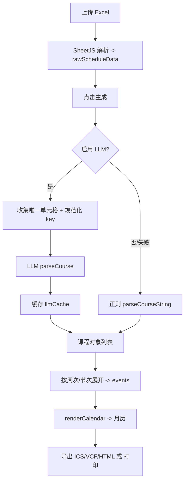

# ScheduleLLM 开发修改过程汇总（Develop.md）

本文档用于系统性记录 ScheduleLLM 在开发与迭代过程中的主要改动、关键决策与技术演进。  
说明：当前仓库未提供可用的 Git 历史/commit 信息给文档生成流程，因此文档中的“Commit”字段统一标记为“待补充”。可按文末命令从本地 Git 记录中回填。

---

## 1. 项目结构概述

### 1.1 总体架构与模块划分

ScheduleLLM 为纯前端单页应用（SPA 形态但不依赖框架），核心由 HTML/CSS/JS 组成，完成“Excel 课表 → 课程结构化解析 → 月历渲染 → 导出/打印”的全流程。

**核心文件与职责**
- `index.html`
  - 页面结构与核心交互入口：上传、生成、导出、打印、LLM 开关与配置、右侧进度/课程面板、月历容器等
- `style.css`
  - 全局视觉风格、响应式布局、月历样式、右侧进度/课程面板样式、提示条/动画、折叠面板样式等
- `script.js`
  - 业务主逻辑：文件解析（SheetJS）、课程文本解析（正则与 LLM 双通道）、事件生成、月历渲染、导出、打印、UI 状态与交互控制、Debug/日志等
- `llm_parser.js`
  - LLM 解析服务封装：Prompt 约束、HTTP 调用、原始响应/耗时统计、解析与后处理（如课程名合并、地点约束）等
- `config.js`（可选）
  - 运行时配置（API Key/BaseUrl/模型）注入，避免手动输入

> 兼容/历史文件：`scriptAG.js` 可能包含旧版逻辑（含打印绑定等），但运行期页面实际引用的是 `script.js`。

### 1.2 主要组件交互关系

**数据流**
1. 用户上传 Excel → `handleFileUpload()` 使用 SheetJS 读取 → 产出 `rawScheduleData`
2. 点击“生成日程/月历” → `generateSchedule()`
   - LLM 开启：收集唯一单元格 → 调用 `llmService.parseCourse()` → 缓存 → 生成课程对象
   - LLM 关闭或失败：走正则解析 `parseCourseString()` 等
3. 课程对象 → 按周次/节次展开 → 生成 `events`（课程事件）→ `renderCalendar(events)` 渲染到 `#calendarArea`
4. 用户可执行：
   - 导出 ICS/VCF：`btnExport` handler
   - 保存 HTML：`btnSaveHtml` handler
   - 打印：`btnPrint` handler

**UI 交互**
- 左侧：配置面板（上传、开学周一、节次时间、LLM 配置、导出/打印）
- 右侧：主内容区（提示条、LLM 进度条/课程面板、月历）

---

## 2. 开发时间线

> 由于当前无法读取本仓库 Git 时间戳，以下时间线按“迭代阶段顺序”整理；日期与 commit 需从 Git log 回填。

### 阶段 A：基础可用版本（Excel → 月历）
- 内容
  - SheetJS 读取 Excel
  - 基础课程解析与事件生成
  - 月历网格渲染与基础样式
- 里程碑
  - 可从 Excel 生成月历并渲染
- Commit：待补充
- 日期：待补充

### 阶段 B：引入 LLM 智能识别与降级策略
- 内容
  - 加入 LLM 开关、BaseUrl/API Key/模型输入
  - LLM 失败时降级到正则解析
- 里程碑
  - LLM 与正则双通道可切换
- Commit：待补充
- 日期：待补充

### 阶段 C：解析鲁棒性增强（地点/周次/班级干扰）
- 内容
  - 非标准地点识别增强（如“桂林洋工程 S308”）
  - 周次提取补强（如从复杂文本中全局扫描，跳过无效大数字）
  - 防止班级/数字串粘连到地点（如“一教N608426”）
- 里程碑
  - 多种 OCR 干扰下解析显著稳定
- Commit：待补充
- 日期：待补充

### 阶段 D：LLM 稳定性、缓存一致性与可观测性
- 内容
  - LLM 原始响应与耗时日志、失败原因记录
  - 统一 LLM 缓存 key 的规范化（避免“LLM 已成功但运行期查不到缓存而回退正则”）
- 里程碑
  - 可追踪“cache_hit / request / error”
- Commit：待补充
- 日期：待补充

### 阶段 E：右侧进度条与课程面板、响应式布局、交互优化
- 内容
  - 进度条：百分比、计数、状态 icon、错误提示与重试
  - 课程面板：可折叠列表与详情
  - PC 侧栏纵向折叠条（不遮挡月历）
  - 月历提示条加入与生成时渐隐
- 里程碑
  - 识别过程有清晰反馈，布局适配更完善
- Commit：待补充
- 日期：待补充

### 阶段 F：左侧节次时间设置折叠面板 & 打印功能修复
- 内容
  - 节次时间设置改为“第1节常显 + 其余可折叠”，支持点击任意区域展开/收起、300ms 动画、提示语切换
  - 修复“打印月历按钮无响应”（原因：`script.js` 未绑定 `btnPrint`，打印逻辑仅存在于历史文件）
- 里程碑
  - 打印恢复可用；左侧配置更紧凑易用
- Commit：待补充
- 日期：待补充

### 阶段 G：打印输出优化（10 行固定高度 + 列宽自适应 + 打印预览）
- 内容
  - 打印输出仅保留月历区域，隐藏识别课程/进度等非打印内容
  - 打印布局：每日课程区域固定为 10 行高度（每节课 2 行），最多显示 5 节
  - 打印列宽：工作日列加宽、周末列在“无课”时变窄；若周末存在课程则自动放宽周末列
  - 内容自适应：窄周末单元格仅显示日期；宽单元格显示日期 + “X课”简要标记
  - 增加“打印预览”步骤：用户可在应用内确认布局后再触发浏览器打印
- 里程碑
  - 打印预览可控、输出更整齐，适配不同纸张/方向的打印宽度变化
- Commit：待补充
- 日期：待补充

---

## 3. 关键改进记录

### 3.1 地点识别增强与去重（解决“工程S308S308”等）
**背景**
- OCR 常导致“地点 + 班级/数字”粘连、或房间号重复拼接。
- 示例：`桂林洋工程S308/23电子信思工程本科1班` 被误识别为 `桂林洋工程S30823电子信思工程本科1`。

**方案**
- 扩展地点关键词与房间号模式（字母数字混合）
- 对中文后缀（室/房间/教室等）进行剥离，只保留字母数字房间号
- 增加合并逻辑的去重保护（building/room 合并时去除重复）

**效果**
- 非标准地点命中率提升
- 粘连与重复显著减少

**相关文件**
- `script.js`
- `llm_parser.js`（地点“禁止自主扩展”约束）

**Commit**
- 待补充

---

### 3.2 周次提取全局扫描（修复复杂文本中周次为空）
**背景**
- 某些课程文本包含大量数字（学号/代码/人数/学时），导致周次正则早退或误判。
- 示例：`管理学原理(43011091)★ ... 4-16周 ...` 解析得到 `weeks=[]`。

**方案**
- 使用全局匹配（global regex scan）遍历所有可能的周次片段
- 设置周次合理范围阈值（例如 >30 的数字跳过），避免被课程代码等污染

**效果**
- 周次识别更稳定，误漏大幅下降

**相关文件**
- `script.js`

**Commit**
- 待补充

---

### 3.3 LLM 缓存 Key 统一（修复“LLM 成功但仍回退正则”）
**背景**
- 预处理阶段对单元格做了规范化（换行、全半角、符号等），但运行期查缓存使用了原字符串 `trim()`，导致 key 不一致。

**方案**
- 引入统一的 canonical key 函数（示例名：`canonicalizeLLMCellKey`）
- 预跑 LLM 与运行期查缓存均使用同一个 key

**效果**
- cache_hit 真实可信，避免无意义的回退正则
- 减少重复请求，提高性能与稳定性

**相关文件**
- `script.js`

**示例片段（示意）**
```js
const key = canonicalizeLLMCellKey(cell);
uniqueCells.add(key);

// later
const cacheKey = canonicalizeLLMCellKey(cellContent);
if (llmCache.has(cacheKey)) { ... }
```

**Commit**
- 待补充

---

### 3.4 LLM Prompt 约束：禁止地点名称自主扩展 + 课程名合并策略
**背景**
- LLM 可能将“ 一教 ”扩展成“第一教学楼”，破坏“保持原始输入”的需求。
- “电气工程及其自动化专业导论”被拆成“专业/导论”，仅返回“导论”。

**方案**
- Prompt 中加入严格规则：地点名称必须原样输出，仅允许空格/标点的必要修正
- 后处理合并策略：当 `name` 过于泛化（导论/概论/原理等）且 `className` 看起来像“专业名”，并且原文中存在拼接串时，将其合并为课程名

**效果**
- 地点字段更可控、更贴近原始表格
- 课程名识别更完整，减少“只剩导论”的情况

**相关文件**
- `llm_parser.js`

**Commit**
- 待补充

---

### 3.5 可观测性：日志、耗时分段、错误归因
**背景**
- LLM 失败具有偶发性且难复现，需要系统化日志以定位输入差异、网络、解析失败类型。

**方案**
- 记录 LLM 的 request/response（裁剪后）、JSON parse 失败片段、fetch/json/post/total 耗时
- 持久化日志（如 localStorage）并对 cache_hit/request/error 分类输出

**效果**
- 可快速定位失败原因与回退路径
- 改动后可进行回归核验

**相关文件**
- `script.js`
- `llm_parser.js`

**Commit**
- 待补充

---

### 3.6 UI/交互：右侧进度条、课程面板、提示条渐隐、布局居中
**背景**
- LLM 识别过程需要可见反馈；课程列表在不同端需要更合适的承载方式；提示条与两栏布局可能造成视觉偏移。

**方案**
- 右侧进度条：进度、计数、icon（warn/done/err）、错误条+重试
- 课程面板：可折叠列表+详情
- 提示条：生成开始时 300ms 渐隐，结束后 `display:none`
- 两栏布局：Grid areas 明确 `hint/calendar/sidebar` 防止自动排布导致月历偏移

**效果**
- 识别过程透明、可操作（可重试）
- PC/移动端体验更一致
- 月历居中稳定

**相关文件**
- `index.html`
- `style.css`
- `script.js`

**Commit**
- 待补充

---

### 3.7 打印按钮无响应修复
**背景**
- `index.html` 有 `btnPrint`，但 `script.js` 中没有绑定事件监听；旧逻辑在 `scriptAG.js` 中但未被页面引用。

**方案**
- 在 `script.js` 中补齐 `btnPrint` click handler：生成打印视图容器 → `window.print()` → 恢复页面

**效果**
- 打印功能恢复可用

**相关文件**
- `script.js`

**Commit**
- 待补充

---

### 3.8 打印输出优化：10 行固定高度、周末列宽调整、打印预览
**背景**
- 月历打印场景下，需要保证：内容不溢出、单元格对齐美观、周末“无课日”不浪费横向空间，并提供可确认的预览流程。

**方案**
- 打印布局（仅 `@media print` 生效）：
  - A4 安全边距（`@page margin`）
  - 每日课程区域固定为 10 行高度（每节课 2 行），并限制每日最多 5 节课
  - 课程名称行超出自动省略号截断，节次+地点行完整显示
- 打印列宽（仅打印模式生效）：
  - `.calendar-grid` 使用不等列宽：周一至周五加宽，周六/周日无课时收窄
  - 当当月周末存在课程时，给 `.calendar-grid` 增加 `print-weekend-has-courses`，自动放宽周末列避免拥挤
- 内容自适应：
  - 周末无课日：`calendar-day.print-narrow` 隐藏 `.day-events`，仅显示日期
  - 非窄列单元格：在日期旁显示 “X课” 简要标记（`day-marker`）
- 交互流程：
  - 打印按钮进入“打印预览”视图（含「打印/返回」），用户确认后再触发 `window.print()`
  - 打印结束后恢复原页面，并重新绑定月历导航按钮事件，避免打印后导航失效

**效果**
- 输出更紧凑且对齐稳定：工作日信息密度更高、周末无课不浪费宽度
- 预览可控：用户可先确认布局，再进入浏览器打印对话框

**相关文件**
- `script.js`
- `style.css`

**Commit**
- 待补充

---

## 4. 功能提升总结

### 4.1 新增/增强功能点梳理

- LLM 智能识别（可选开关）
  - 业务价值：显著提升复杂课程格子的解析准确率
  - 技术方案：`llm_parser.js` 服务化封装 + 统一缓存 key + 失败降级正则

- 识别进度与课程面板
  - 业务价值：让用户明确“识别到哪了/是否卡住/是否可重试”
  - 技术方案：右侧进度组件 + 动画/状态 + 课程列表与详情

- OCR/复杂文本鲁棒解析
  - 业务价值：减少手工修正，降低走错教室/周次错误
  - 技术方案：地点识别增强、周次全局扫描、班级与数字干扰过滤、房间号去重

- 上传提示与提示条渐隐
  - 业务价值：降低新手学习成本、避免提示长驻干扰
  - 技术方案：上传后状态提示 5 秒淡出；生成开始时提示条渐隐并隐藏

- 节次时间设置折叠面板
  - 业务价值：左侧面板更紧凑，仍保留高频“第1节时间”可快速修改
  - 技术方案：DOM 重构为“常显 + 折叠区”，CSS 300ms 动画，点击空白区域触发折叠

- 导出与打印完善
  - 业务价值：可导入手机/桌面日历、可打印（并支持打印预览确认）
  - 技术方案：ICS/VCF 生成、HTML 导出、打印视图构建与恢复、打印模式列宽自适应（工作日加宽/周末无课变窄）

### 4.2 关键决策记录

- “保持原始地点文本”优先于“规范化地点名称”
  - 原因：规范化会引入不可控扩展（如一教→第一教学楼），破坏用户预期与可追溯性

- “LLM 失败必须可降级”
  - 原因：网络与服务不稳定时仍需可用；用户可选择更快但较不准的正则模式

- “缓存 key 必须统一”
  - 原因：输入规范化若不一致，会造成难以解释的行为（表面 LLM 成功但实际回退）

---

## 附：流程图（数据流）



---

## 附：如何补全 commit 记录

在项目根目录执行（Windows 也适用）：

```bash
git log --date=short --pretty=format:"%h %ad %s"
```

然后把每个改进对应的 commit hash 回填到本文档相应位置的 “Commit：待补充”。